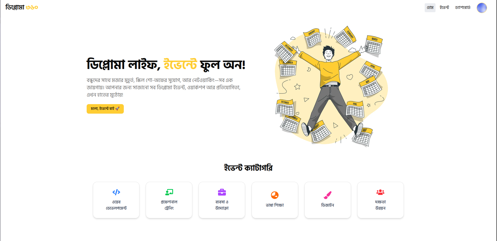
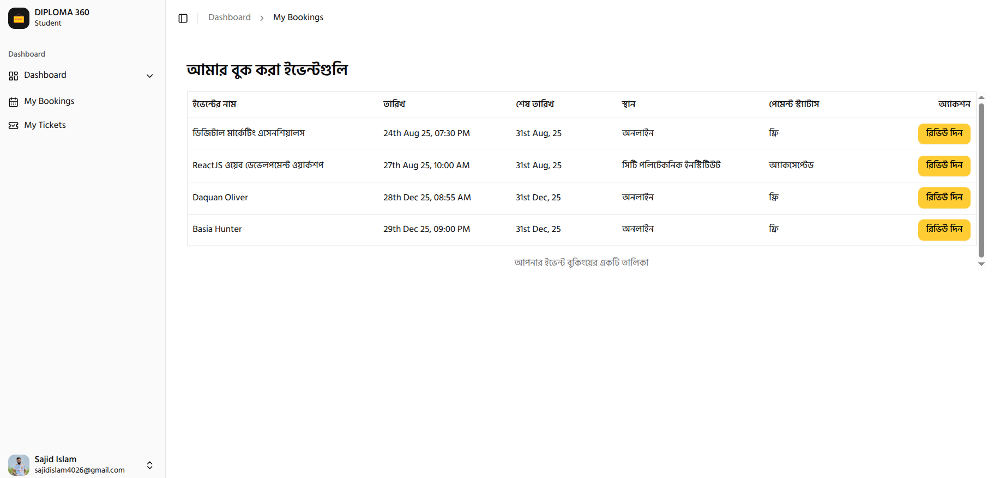
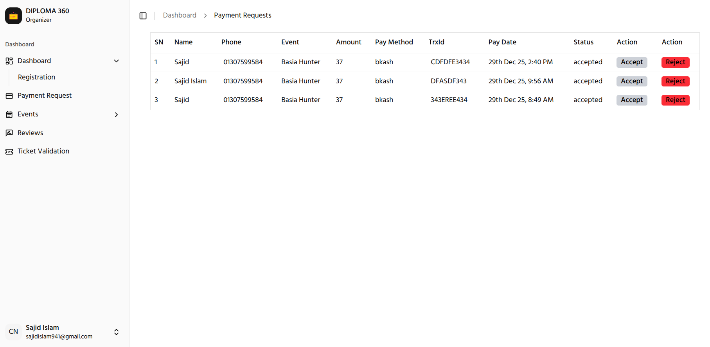
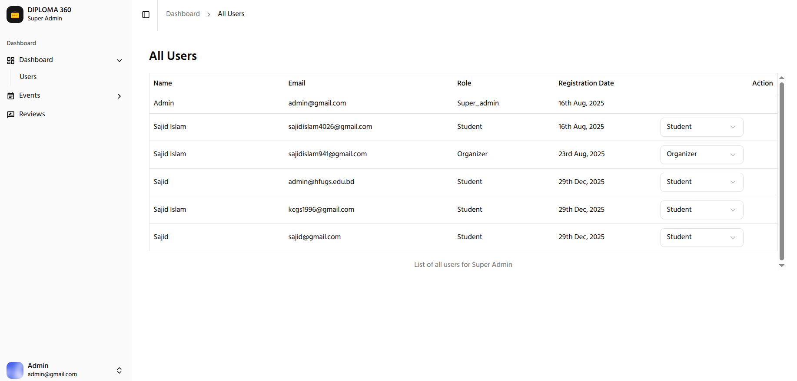

# Diploma360 – Frontend

A modern, responsive frontend application built with **Next.js** and **Tailwind CSS**, designed to unify diploma students through events, learning opportunities, and community engagement.

This frontend consumes a RESTful backend API and provides role-based dashboards for **students**, **organizers**, and **super admins**.



---

## 🚀 Tech Stack

- **Framework:** Next.js
- **Styling:** Tailwind CSS, Shadcn UI
- **Authentication:** JWT (via HTTP-only cookies)
- **HTTP Client:** Axios
- **UI Utilities:** SweetAlert2, Sonner (toast)
- **Icons:** Lucide Icons
- **Deployment:** Vercel

---

## Key Features

### Student

- Browse and register for events
- View personal **event timeline**
- Join online events when date & time match
- QR-based ticket system
- Event reviews and ratings

### Organizer

- Create, update, and delete events
- View all event registrations
- Manage participant data
- Review feedback from attendees

### Super Admin

- View all users in a dashboard table
- Change user roles (student / organizer)
- Secure role-based access control

---

## Project Structure

```
└── 📁src
    └── 📁app
        └── 📁(auth)
        └── 📁(main)
        └── 📁dashboard
        ├── globals.css
        ├── layout.jsx
    └── 📁components
    └── 📁hooks
    └── 📁images
    └── 📁lib
    └── 📁redux
    └── 📁services
```

## 📸 Screenshots

| Student                                                                       | Organizer                                                                             | Super Admin                                                                  |
| ----------------------------------------------------------------------------- | ------------------------------------------------------------------------------------- | ---------------------------------------------------------------------------- |
|  |  |  |

---

## Run Locally

Follow these steps to run the frontend on your local machine.

### 1. Clone the Repository

```bash
git clone https://github.com/sajid-islam/Diploma360-Client
cd Diploma360-Client
npm install

```

### 2. Setup Environment Variables

```env
NEXT_PUBLIC_FIREBASE_API_KEY=
NEXT_PUBLIC_FIREBASE_AUTH_DOMAIN=
NEXT_PUBLIC_FIREBASE_PROJECT_ID=
NEXT_PUBLIC_FIREBASE_STORAGE_BUCKET=
NEXT_PUBLIC_FIREBASE_MESSAGING_SENDER_ID=
NEXT_PUBLIC_FIREBASE_APP_ID=
NEXT_PUBLIC_API_BASE_URL=
```

### 3. Start the Server

```
npm run dev

```
